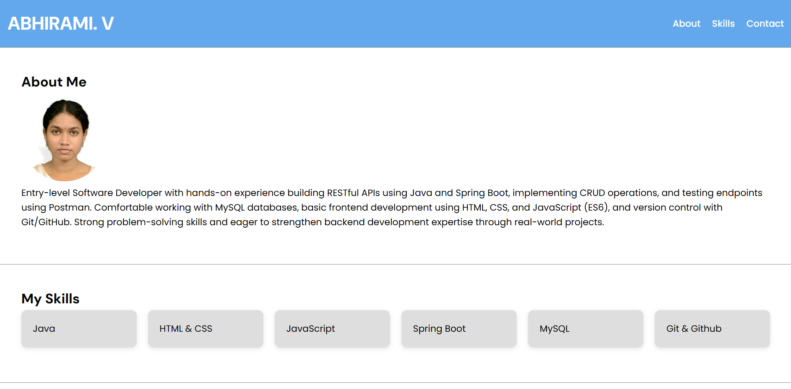
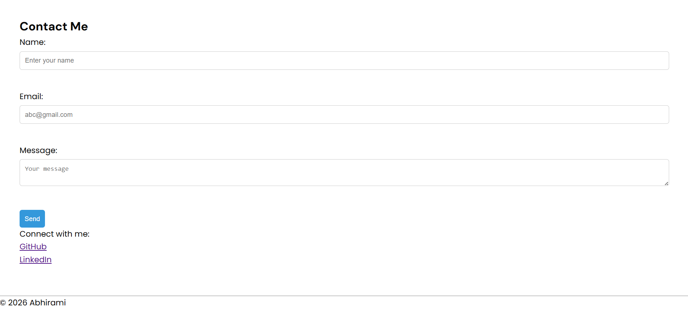

# Personal Portfolio Website

## Project Overview
This project is a simple personal portfolio website built using HTML, and enhanced the user interface and user experience using CSS.
The goal of this project is to showcase personal information, technical skills, and provide a contact interface using a structured and semantic HTML layout, along with responsive design for mobile screens.


## Setup Instructions
1. Download or clone the repository  
2. Open the project folder  
3. Run the `index.html` file in any web browser  


##  Code Structure
The project follows a clean and organized structure:
```
portfolio/
|---index.html        (Main webpage)
|---README.md         (Documentation) 
|---images/           (Stores image assets)
  |---profile.jpg
|--screenshots/  
  |---html_img1.png
  |---html_img2.png
  |--css_img1.png
  |--css_img2.png
```
## Visual Documentation
The following screenshots demonstrate the functionality of the project:
- Homepage with navigation bar  
- About section with profile image  
- Skills section displaying technical skills  
- Contact form with input fields  





## CSS Concepts Used
- Reset and Box model
- Variables
- Google Fonts
- Layout techniques(Flexbox & Grid)
- Hover Effects & Transitions
- Smooth Scrolling


## Technical Details
- The project uses a single-page layout with section-based navigation.
- Used Google fonts(DM Sans, Poppins) for improved typography and visual hierarchy.
- Utilized Flexbox for header layout alignment and CSS Grid for creating a responsive skills section.
- `auto-fit` dynamically adjusts the number of columns based on available space, while `minmax()` ensures flexible and responsive sizing.
- Implemented animated hover effects using CSS transitions with transform and box-shadow to create a smooth elevation interaction.
- Implemented media queries to ensure responsiveness across mobile screen sizes.

## Testing Evidence
- Checked for cross-compatibility across browsers(Chrome, Edge and Brave).
- Validated form for constraints(empty fields are not allowed).
- Confirmed image loads correctly from folder  


## Conclusion
This project demonstrates the fundamentals of HTML and web page structure along with CSS enhancing the presentation of the portfolio.
It serves as a foundation for frontend development skills incorporating responsive design and modern CSS techniques.