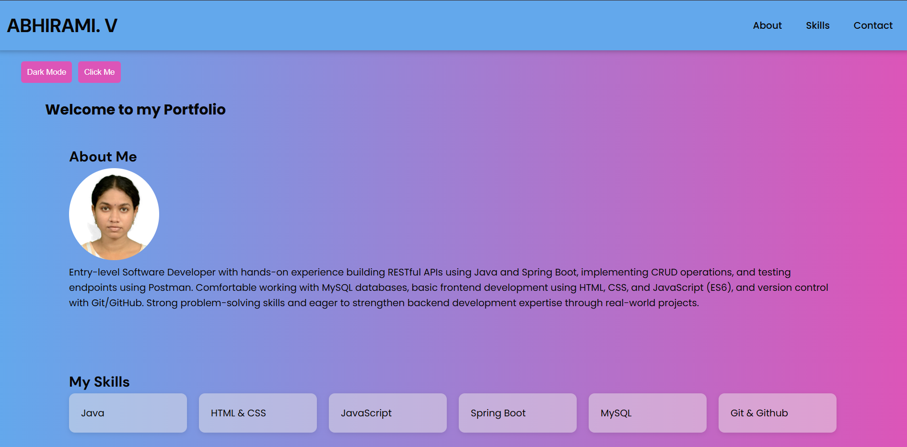

# Interactive Portfolio Website

##  Project Overview
This project is a personal portfolio website enhanced with JavaScript interactivity.  
It demonstrates how static web pages can be transformed into dynamic, user-friendly applications using JavaScript.

---

## Setup Instructions
1. Download or clone the repository  
2. Open the project folder  
3. Run the `index.html` file in any web browser 

---

## Project Structure

portfolio/
|---index.html 
|---css/
  |---style.css
|---js/
  |---script.js      
|assets/         
  |---images/           
    |---profile.jpg
  |--screenshots/  
    |---html_img1.png
    |---html_img2.png
    |--css_img1.png
    |--css_img2.png
|---README.md    

  ---

## Visual Documentaion

For light mode:

For dark mode:

---

##  Technologies Used
- HTML5 – Structure  
- CSS3 – Styling and layout  
- JavaScript (ES6) – Interactivity and logic  

---

## Technical Details

### Dark/Light Mode Toggle
- Switch between light and dark themes  
- Saves user preference using localStorage  
- Automatically applies on reload  

### Dynamic Welcome Text
- Button click changes the welcome message  
- Demonstrates DOM manipulation  

### Toggle Skills Section
- Show/hide skills dynamically  
- Improves interactivity  

### Contact Form Validation
- Name: Required  
- Email: Regex validation  
- Message: Minimum 10 characters  
- Displays error messages and success feedback  
- Prevents invalid submission  

### Real-Time Email Validation
- Instant feedback while typing  
- Updates input field styles (error/success)  

---

## Key Concepts Used
- DOM Manipulation (`getElementById`, `classList`)
- Event Handling (`click`, `submit`, `input`)
- Functions and Reusability
- Conditional Logic
- Form Validation
- Local Storage (state persistence)

---

## Testing
- All features tested manually  
- Verified form validation and UI behavior  
- Checked dark mode persistence  
- Fixed common edge cases    

---

## 📌 Conclusion
This project demonstrates the practical application of core JavaScript concepts to build an interactive and user-friendly web interface. It highlights skills in DOM manipulation, event handling, form validation, and state persistence using localStorage.

Through this project, a static portfolio was transformed into a dynamic application, reflecting real-world frontend development practices. It serves as a strong foundation for building more advanced, scalable web applications.