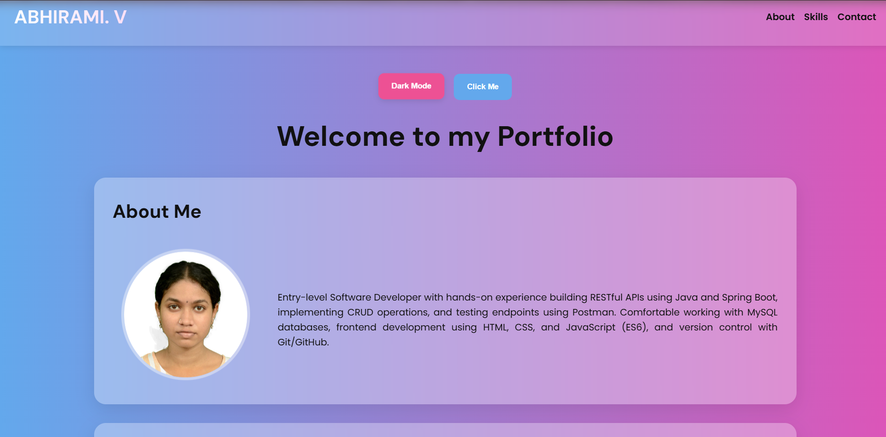
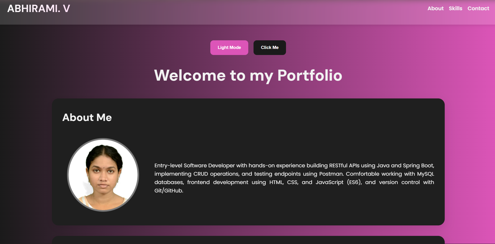
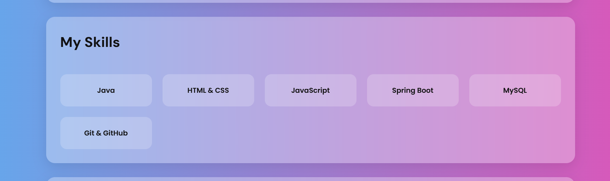
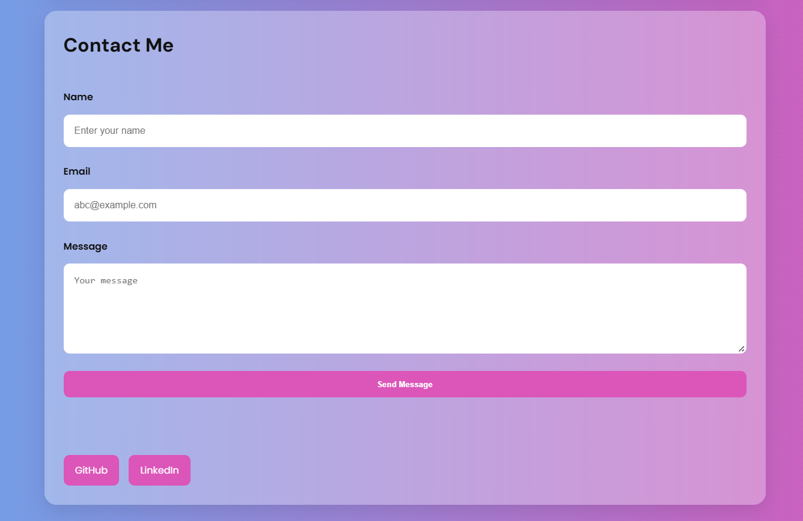

# Advanced Portfolio Website

## Project Overview

This project is an advanced personal portfolio website redesigned using modern CSS techniques and JavaScript interactivity.

The portfolio demonstrates responsive web design, CSS Grid layouts, Flexbox components, animations, theme switching, and organized CSS architecture using the BEM methodology.

The goal of this project is to transform a basic static portfolio into a modern, interactive, and scalable frontend application.

---

# Features

## Responsive Design
- Mobile-first responsive layout
- Optimized for desktop, tablet, and mobile devices
- Flexible layouts using CSS Grid and Flexbox

---

## CSS Grid Layout
- Responsive skills section using CSS Grid
- Flexible portfolio layout structure
- Auto-fit responsive card system

Example:

```css
.skills__grid {
    display: grid;
    grid-template-columns:
        repeat(auto-fit, minmax(180px, 1fr));
}
```

---

## Flexbox Components
Flexbox is used for:
- Navigation bar
- Hero section buttons
- Contact links
- Header layout
- Responsive alignment

---

## CSS Variables 
Implemented a reusable theme system using CSS variables.

Example:

```css
:root {
    --primary-color: #dc55b8;
    --secondary-color: #63a8ec;
}
```

Benefits:
- Easy theme customization
- Cleaner CSS
- Better maintainability

---

## Dark / Light Theme
- Theme toggle button
- Theme preference saved using localStorage
- Dynamic color switching using CSS variables

---

## Animations & Transitions
Implemented modern UI animations:
- Fade-in animations
- Floating profile image
- Hover effects
- Button animations
- Smooth transitions

Example:

```css
@keyframes fadeInUp {
    from {
        opacity: 0;
        transform: translateY(40px);
    }

    to {
        opacity: 1;
        transform: translateY(0);
    }
}
```

---

## Advanced Selectors & Pseudo Elements
Used advanced CSS selectors including:
- `:hover`
- `:focus`
- `::after`

Example:

```css
.nav__link::after {
    content: "";
    width: 0%;
}
```

---

## BEM Methodology
The project follows BEM (Block Element Modifier) naming conventions for scalable and maintainable CSS.

Examples:

```css
.header__title
.skills__card
.contact-form__input
```

Benefits:
- Organized CSS structure
- Reusable components
- Easier maintenance
- Professional architecture

---

## Form Validation
Implemented JavaScript validation for:
- Name field
- Email validation using Regex
- Minimum message length
- Real-time email validation
- Error and success feedback

---

## Accessibility Improvements
- Semantic HTML structure
- Accessible labels
- `autocomplete` attributes added
- Smooth keyboard interaction support

---

# Technologies Used

- HTML5
- CSS3
- JavaScript (ES6)

---

# Project Structure

```text
portfolio/
│
├── index.html
│
├── css/
│   ├── main.css
│   ├── layout.css
│   └── animations.css
│
├── js/
│   └── theme-switcher.js
│
├── assets/
│   ├── images/
│   │   └── profile.jpg
│   │
│   └── screenshots/
│
└── README.md
```

---

# Responsive Design

The project uses a mobile-first approach.

Responsive breakpoints:
- Mobile Devices
- Tablets
- Desktop Screens

Media queries are implemented using:

```css
@media (min-width: 768px)
```

---

# UI Enhancements

- Gradient backgrounds
- Glassmorphism cards
- Hover animations
- Floating profile image
- Animated navigation underline
- Interactive buttons

---

# JavaScript Functionality

## Theme Switching
- Toggle between dark and light mode
- Stores theme preference using localStorage

## Dynamic Welcome Text
- Updates welcome message dynamically

## Form Validation
- Prevents invalid form submission
- Displays validation errors
- Real-time email checking

---

# Testing

The project was tested for:
- Responsive layouts
- Dark mode persistence
- Form validation
- Navigation functionality
- Mobile compatibility
- Cross-browser layout consistency

Browsers tested:
- Google Chrome
- Microsoft Edge
- Brave

---

# Screenshots

- Homepage


- Dark Mode


- Skills


- Contact


---

# Performance & Optimization

- Organized CSS architecture
- Separated CSS files
- Reusable variables
- Smooth animations
- Responsive image handling
- Optimized layout structure

---

# Learning Outcomes

Through this project, the following concepts were practiced:

- CSS Grid
- Advanced Flexbox
- CSS Variables
- Animations & Transitions
- Responsive Design
- Mobile-first Development
- BEM Methodology
- DOM Manipulation
- Form Validation
- Local Storage

---

# Conclusion

This project demonstrates modern frontend development practices using HTML, CSS, and JavaScript.

The portfolio evolved from a simple static webpage into a responsive, interactive, and visually enhanced application that follows scalable CSS architecture and modern UI design principles.

It serves as a strong foundation for building advanced frontend applications and showcases practical implementation of responsive layouts, animations, theming, and maintainable code structure.