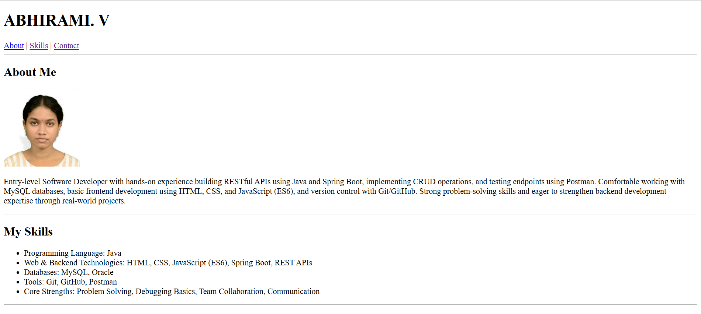
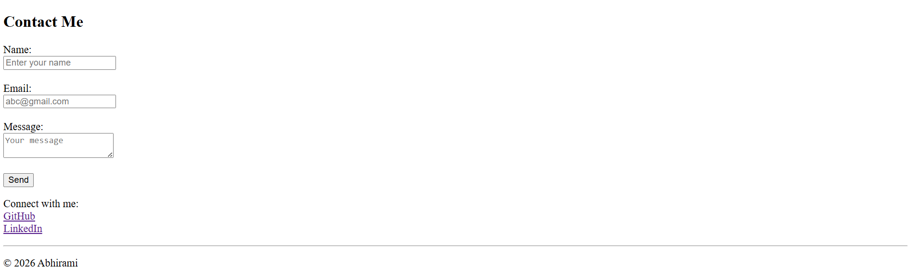

# Personal Portfolio Website

## Project Overview
This project is a simple personal portfolio website built using HTML.  
The goal of this project is to showcase personal information, technical skills, and provide a contact interface using a structured and semantic HTML layout.


## Setup Instructions
1. Download or clone the repository  
2. Open the project folder  
3. Run the `index.html` file in any web browser  


##  Code Structure
The project follows a clean and organized structure:
```
portfolio/
|---index.html        (Main webpage)
|---README.md         (Documentation) 
|---images/           (Stores image assets)
  |---profile.jpg
  |---portfolio_img1.png
  |---portfolio_img2.png
```
## Visual Documentation
The following screenshots demonstrate the functionality of the project:
- Homepage with navigation bar  
- About section with profile image  
- Skills section displaying technical skills  
- Contact form with input fields  





## HTML Concepts Learned
- HTML document structure (`<!DOCTYPE>`, `<html>`, `<head>`, `<body>`)
- Semantic elements (`header`, `nav`, `main`, `section`, `footer`)
- Anchor tags for internal navigation (`#about`, `#skill`, `#contact`)
- Lists (`ul`, `li`) for structured data display
- Forms (`input`, `textarea`, `button`) with validation (`required`)
- Image embedding using `` with `alt` attribute


## Technical Details
- The project uses a single-page layout with section-based navigation
- No algorithms or complex data structures are used  
- The project is based on static HTML architecture  
- Uses semantic HTML for better accessibility and structure  
- Internal linking is implemented for navigation  

## Testing Evidence
- Verified all navigation links scroll to correct sections  
- Checked form validation (empty fields are not allowed)  
- Tested in browser to ensure proper rendering  
- Confirmed image loads correctly from folder  


## Conclusion
This project demonstrates the fundamentals of HTML and web page structure.  
It serves as a beginner-level portfolio showcasing basic frontend development skills.